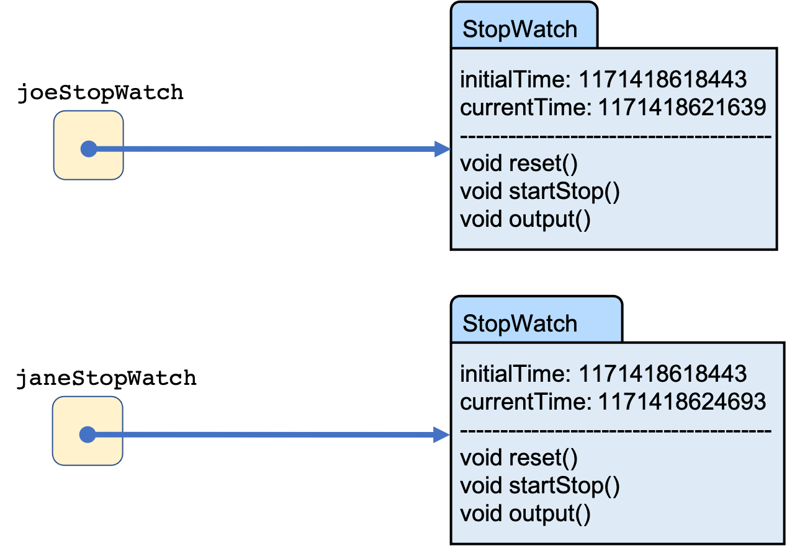
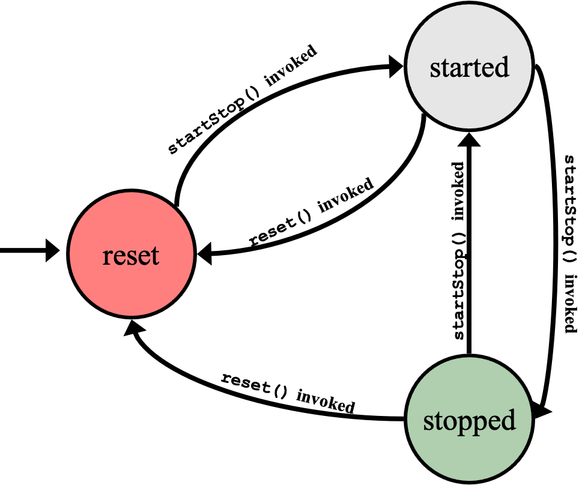
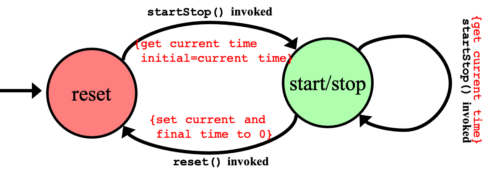

# Recitation 6 - Designing FSMs for Objects

## Learning Outcomes

By the end of this activity, a student should be able to:

1. Design an FSM for an Object
2. Implement the FSM in a class
3. Create an Object and invoke the behavior bore out by the FSM
4. Use the FSM implemented in StopWatch to animate a timer in Greenfoot

## The Stop Watch Class

As part of a project, it is determined that there is a need to design a stopwatch that simulates a stopwatch in real life.  

On a computer, the timer is a counter where each count represents a unit of time equivalent to the speed of the processor.  So, if you have a 1GHz machine, then the unit of time is 1x10<sup>-9</sup> seconds or 1 nanosecond (ns).  In this case, each count represents 1ns.  The timer starts counting at the point the battery is installed in the computer and continues counting until the battery dies.  The elapsed time is measured by taking the difference between the final count and the initial count.

Our stopwatch must, therefore, remember the initial count and the final count.  Also, the stopwatch must have the following behavior.

**Class Name:** <span style="color:red;">StopWatch</span>

**Methods (actions/behaviors):**

	reset:		press reset button to reset stopwatch to 0.
	startStop:	press start/stop button to start/stop counting.
	output:		display time elapsed.

**Data:**

	InitialTime: count when reset was pressed.
	CurrentTime: current count.

In Java, this would look like,

```java
public class StopWatch
{
    private long initialTime;
    private long currentTime;

    public StopWatch(){ ...}
    public void reset(){ ... }
    public void startStop(){ ... }
    public long elapsedTime(){ ... }
    public String toString(){ ... }

```

Creating StopWatch objects,

```java
StopWatch joeStopWatch=new StopWatch();
StopWatch janeStopWatch=new StopWatch();

```
results in the following object diagrams.

<div style="text-align:center;">

</div>

An example usage of the class is as follows.

```java
public class StopWatchTest{
	public static void main(String[] args){
		StopWatch joeStopWatch=new StopWatch();
		StopWatch janeStopWatch=new StopWatch();
		joeStopWatch.reset();
		janeStopWatch.reset();
		joeStopWatch.startStop();
		janeStopWatch.startStop();
		System.out.println(“Stop watch started”);
		for(long i=0; i < 1000000000; i++);
		janeStopWatch.startStop();
		for(long i=0; i < 1000000000; i++);
		joeStopWatch.startStop();
		janeStopWatch.output();
		joeStopWatch.output();
	}
}

```

## Designing the StopWatch

When a StopWatch object is created, it should be in reset mode.

- That is, if we operate on the object with `toString()`, it should display 0h 0m 0s.

- Once the `startStop()` method is invoked on the StopWatch object, the object should “begin counting”.

- Subsequent invocations of the `startStop()` method should result in setting the elapsed time.  **Note that the object continues to count**.

- A `reset()` invocation sets the elapsed time back to 0 and places the StopWatch object back in the reset state.

Using this information, the FSM looks as follows:

<div style="text-align:center;">

</div>

However, you will notice that the same invocation results in the state
changing between the **Stopped** and **Started** states.  This indicates that the two states can be combined into a single state.

<div style="text-align:center;">

</div>

We, therefore, have a two-state system, which leads to using boolean values to enumerate the states and a boolean variable to track the current state.

```java
public class StopWatch
{
    private boolean isInReset;
    private long initialTime;
    private long currentTime;

    public StopWatch(){ ...}
    
    
    public void reset(){ 
       isInReset = true;
       initialTime = currentTime = 0;
    }
    
    public void startStop(){ ... }
    public long elapsedTime(){ ... }
    public String toString(){ ... }

```

Now, for the transitions, notice that the conditions are not conditions but rather invocations of methods.  So, in the `startStop()` method the transition of state is addressed.


```java
public class StopWatch
{
    private boolean isInReset;
    private long initialTime;
    private long currentTime;

    public StopWatch(){ ...}
    public void reset(){ ... }
        
    public void startStop(){
    	
	if (isInReset){
	    currentTime = Calendar.getInstance().getTimeInMillis();
	    initialTime = currentTime;
	    isInReset=false;
	} else {
	    currentTime = Calendar.getInstance().getTimeInMillis();
	}
    }
    
    public long elapsedTime(){ ... }
    public String toString(){ ... }

```
Now, notice that the same line of code,

```java
currentTime = Calendar.getInstance().getTimeInMillis();
```

appears in both the if and else part.  So, we can factor that line of code out before the if-else statement (*why not after?*) and get rid of the empty else part.

```java
public class StopWatch
{
    private boolean isInReset;
    private long initialTime;
    private long currentTime;

    public StopWatch(){ ...}
    public void reset(){ ... }  
    
    public void startStop(){
    	currentTime = Calendar.getInstance().getTimeInMillis();
	if (isInReset){
	    initialTime = currentTime;
	    isInReset=false;
	}
    }
    
    public long elapsedTime(){ ... }
    public String toString(){ ... }

```

Elapsed time is now easy to implement.


```java
public class StopWatch
{
    private boolean isInReset;
    private long initialTime;
    private long currentTime;

    public StopWatch(){ ...}
    public void reset(){ ... }
    public void startStop(){ ... }
        
    public long elapsedTime(){
    	return (currentTime - initialTime);
    }
    
    public String toString(){ ... }

```

Finally, we implement the `toString()` method as,

```java
public class StopWatch
{
    private boolean isInReset;
    private long initialTime;
    private long currentTime;

    public StopWatch(){ ...}
    public void reset(){ ... }
    public void startStop(){ ... }    
    public long elapsedTime(){ ... }
    
    public String toString(){
    	long elapsedSecs = elapsedTime()/1000;
        long elapsedHours = elapsedSecs/3600;
        elapsedSecs -= (elapsedHours*3600);
        long elapsedMins = elapsedSecs/60;
        elapsedSecs -= (elapsedMins*60);
        return elapsedHours + "h " + elapsedMins + "m " + elapsedSecs + "s";
    }

```

The full class is provided in the StopWatch class in this project.

## Using the StopWatch class in Greenfoot

This project is a Greenfoot project that contains an Actor subclass called Timer.  This Actor object will animate a timer by continuously clearing and drawing the timer provided by a StopWatch object.  The Timer class contains a constructor that initializes the image and sets the font and font color.

```java
public class Timer extends Actor
{
    private GreenfootImage stopwatchImage;
    private StopWatch stopWatch;

    public Timer()
    {
        stopWatch = new StopWatch();
        Font font = new Font(true,false,24);
        stopwatchImage = new GreenfootImage(250,50);
        stopwatchImage.setColor(Color.YELLOW);
        stopwatchImage.setFont(font);
        stopwatchImage.drawString(stopWatch.toString(),0,20);
        setImage(stopwatchImage);
        stopWatch.startStop();
    }

    public void act(){ ... }
}
```

## Your Assignment

Implement the `act()` method in the Timer class so that when the run button is pressed, the timer animates and shows the elapsed time on the screen.
